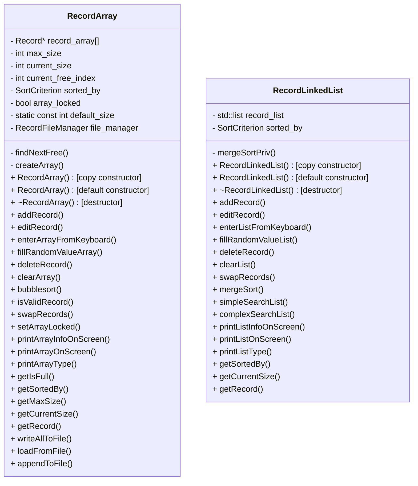
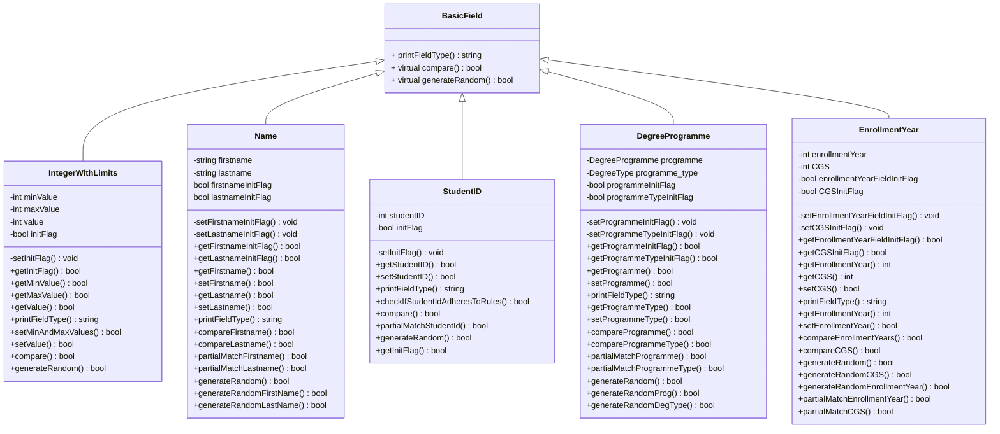
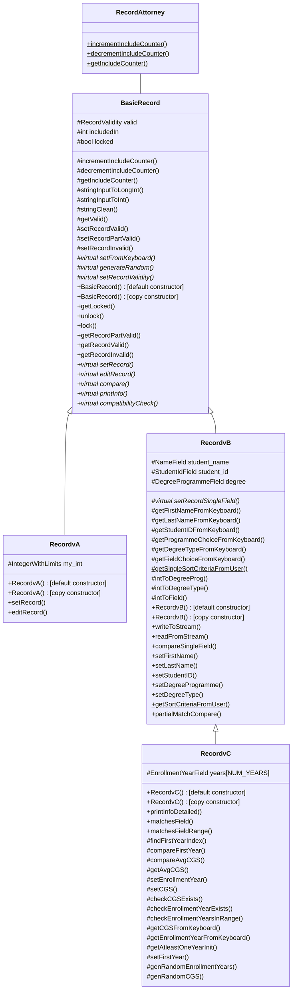

This repo contains a group project to create a student record system, created over a few weeks as part of a course we (Raghav, Yousef, Dave) were taking.

Issues and design discussion were tracked using github issues on the original (private) repo. Some design details remain below.

All references to course task specific details including the release stages, exact requirements etc have been removed as requested by course staff.

# Conventions & Standards

**Target: C++11 using clang++ and gcc++ compilers on Windows and Linux**

## Naming

- lowerCamelCase *for functions*
- UpperCamelCase *for classes*
- snake_case *for variables*
- enum {UPPER_SNAKE=0, INSIDE_ENUMS}

## Files

- Define all functions in their respective header file (as per course convention) rather than having a separate .cpp file.

# Design

https://mermaid.live

## Classes

### DataArray

Owner: Dave

## Items

Owner: Yousef

## Records

Owner: Raghav

